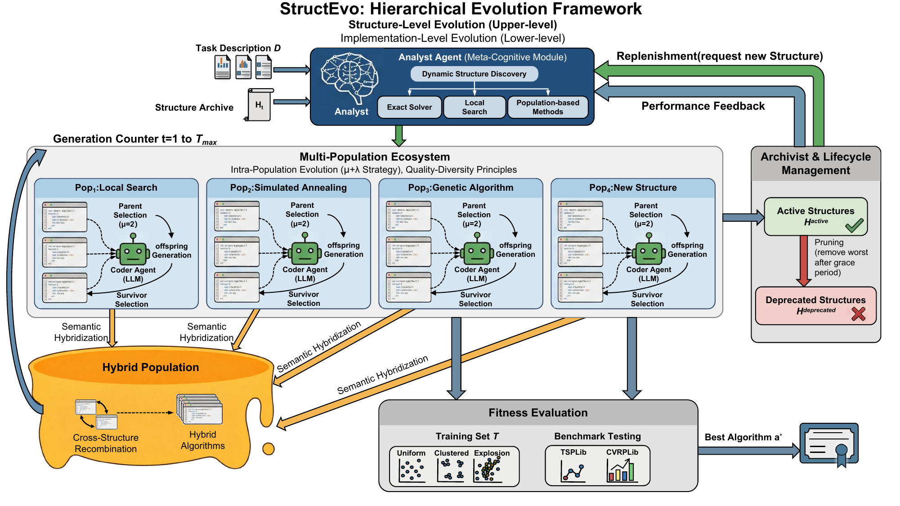

This package contains the public source release, which includes the EoH-U source code and the TSP/CVRP benchmark code with the finalized comparison algorithms used in evaluation, including the finalized StructEvo benchmark algorithms. And the StructEvo framework code is going to be availble when this work is publishing.



## Contents

```text
/
├── eohu/                  # EoH-U source
├── tsp_benchmark/         # TSP benchmark and comparison algorithms
├── cvrp_benchmark/        # CVRP benchmark and comparison algorithms
├── docs/assets/           # Documentation figures
├── requirements.txt
└── README.md
```

## Installation

Use Python 3.11 or later.

```bash
pip install -r requirements.txt
```

## Configuration

API settings are stored in:

- `eohu/config/tsp_config.py`
- `eohu/config/cvrp_config.py`

## Running EoH-U

```bash
python eohu/main.py --problem tsp
python eohu/main.py --problem cvrp
```

## Running Benchmarks

TSP benchmark on instances:

```bash
python tsp_benchmark/run_experiment_le150.py
```

CVRP benchmark on instances:

```bash
python cvrp_benchmark/run_experiment_le150.py
```

TSP StructEvo budget sweep over finalized benchmark algorithms:

```bash
python tsp_benchmark/run_structevo_budget_sweep_le150.py
```
